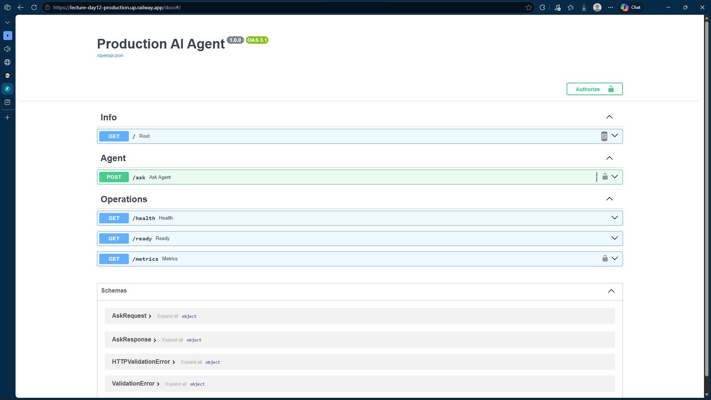
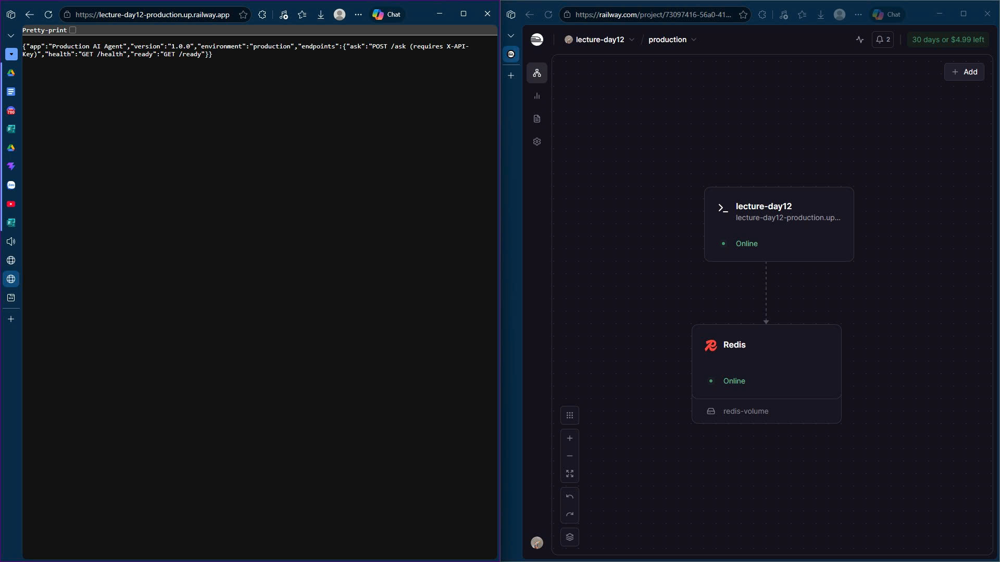
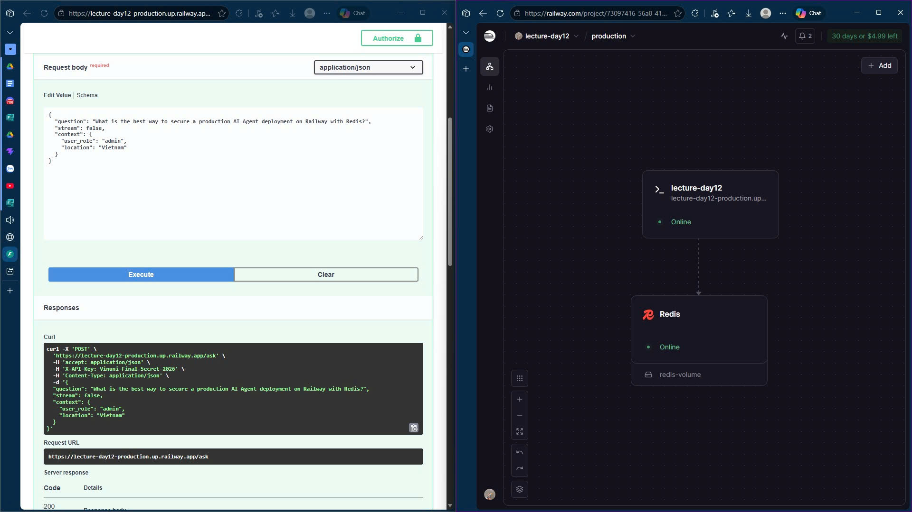
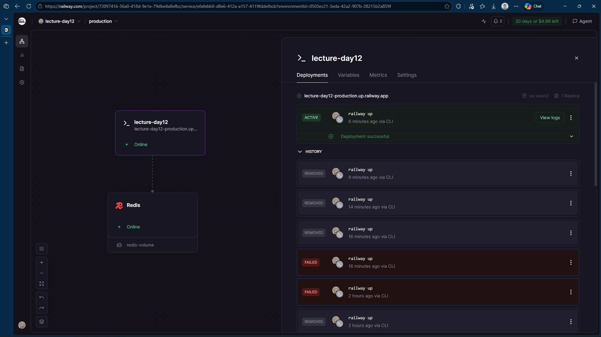

# Deployment Information — AI Agent production

Đây là tài liệu hướng dẫn triển khai và thông tin vận hành của hệ thống AI Agent hoàn thiện (Day 12 Final Project).

## 🌐 Public URL
**URL:** [https://lecture-day12-production.up.railway.app](https://lecture-day12-production.up.railway.app)
**Trạng thái:** Online & Ready

---

## 🚀 Setup Guide (Hướng dẫn cài đặt)

### 1. Triển khai lên Railway (Cloud)
Nếu bạn muốn tự triển khai một bản sao:
1.  **Fork** repository này về GitHub của bạn.
2.  Trên **Railway Dashboard**, chọn `New Project` -> `Deploy from GitHub repo`.
3.  **Thêm Redis**: Chọn `+ New` -> `Database` -> `Redis`.
4.  **Cấu hình Variables**: Tại service Agent, nạp các biến sau:
    - `ENVIRONMENT`: `production`
    - `AGENT_API_KEY`: Mã khóa bảo mật của bạn.
    - `JWT_SECRET`: Mã ký token.
    - `REDIS_URL`: Liên kết từ service Redis.
5.  Railway sẽ tự động build và cấp phát URL công khai.

### 2. Chạy Local (Docker Compose)
Dành cho việc kiểm tra nhanh dưới máy cá nhân:
```bash
cd 06-lab-complete
docker-compose up --build
```
Hệ thống sẽ khởi chạy 3 Agent instances đằng sau một Nginx Load Balancer tại cổng `8080`.

---

## 🧪 Test Commands (Lệnh kiểm tra)

### 1. Kiểm tra sức khỏe (Health Check)
```powershell
curl.exe https://lecture-day12-production.up.railway.app/health
```
**Kỳ vọng:** Trả về trạng thái `healthy` và Redis `connected`.

### 2. Kiểm tra AI Agent (Có xác thực)
```powershell
curl.exe -X POST https://lecture-day12-production.up.railway.app/ask `
  -H "X-API-Key: Vinuni-Final-Secret-2026" `
  -H "Content-Type: application/json" `
  -d '{"question": "How to scale this agent?"}'
```

---

## 📸 Screenshots (Minh chứng)

### 1. Railway Dashboard & Infrastructure

*Mô tả: Cấu hình Project trên Railway bao gồm Agent service và Redis service.*

### 2. Build & Deployment Process

*Mô tả: Quá trình Build Multi-stage Docker thành công, tối ưu dung lượng.*

### 3. Service Running (Logs & Status)

*Mô tả: Trạng thái Online và các log truy cập JSON chuẩn xác.*

### 4. API Test Results (Swagger UI)

*Mô tả: Kết quả thử nghiệm thành công trên giao diện `/docs` với API Key.*

---

## 🔑 Environment Variables summary
- `PORT`: Tự động (Railway).
- `REDIS_URL`: Chuỗi kết nối Database.
- `AGENT_API_KEY`: Chìa khóa bảo mật API.
- `JWT_SECRET`: Khóa ký Token bảo mật.
- `ENVIRONMENT`: Chế độ `production`.
