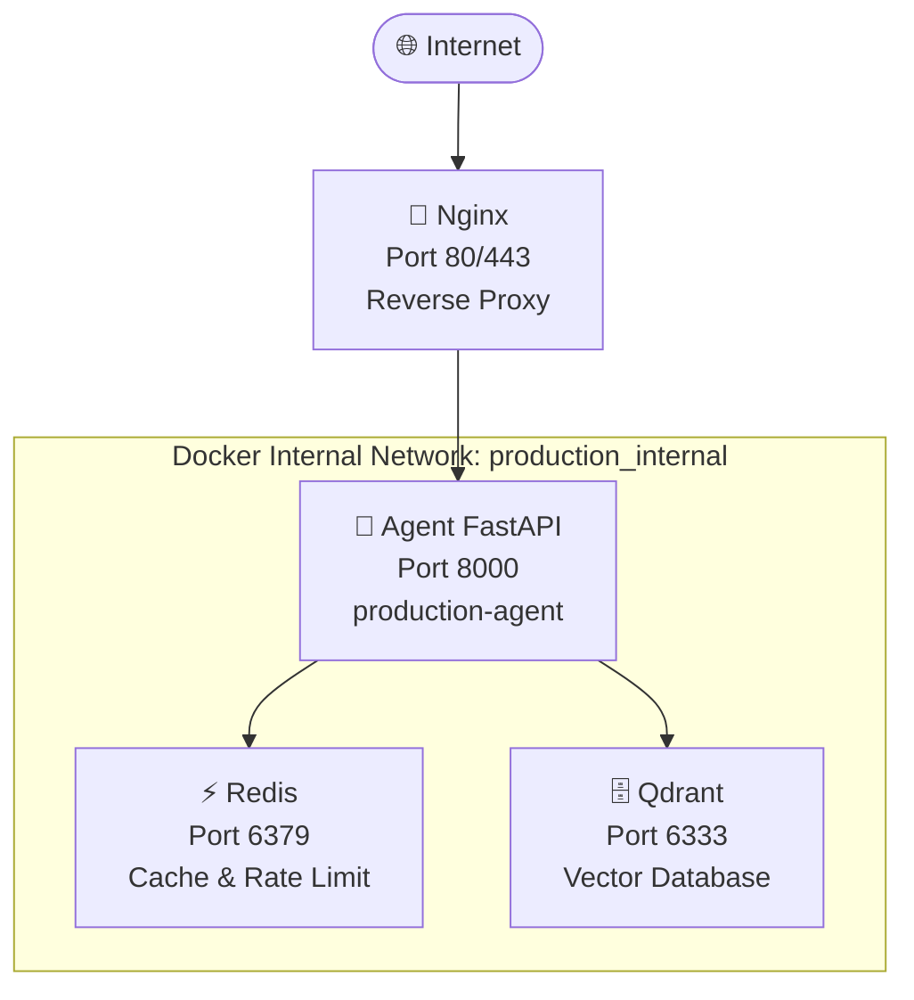

# Day 12 Lab - Mission Answers

## Part 1: Localhost vs Production

### Exercise 1.1: Anti-patterns found
1. **Hardcoded Secrets**: API keys và Database URLs được ghi trực tiếp trong mã nguồn (`app.py`), dẫn đến nguy cơ lộ bí mật nếu code được chia sẻ hoặc push lên GitHub.
2. **Thiếu Quản lý Cấu hình Tập trung**: Các biến cấu hình như `DEBUG` và `MAX_TOKENS` nằm rải rác trong file chính, thay vì được quản lý tập trung và đọc từ biến môi trường.
3. **Sử dụng print() thay vì Proper Logging**: Dùng `print()` không cung cấp timestamp hay log levels, và đặc biệt nguy hiểm khi log cả secret key ra màn hình console.
4. **Thiếu Health Check Endpoint**: Không có endpoint `/health`, khiến các nền tảng tự động hóa (Cloud orchestrators) không thể kiểm soát trạng thái của Agent để tự khởi động lại khi gặp lỗi.
5. **Cấu hình Hạ tầng Cố định**: Hardcode `host="localhost"` và `port=8000` khiến ứng dụng không thể chạy trên các môi trường đám mây (Cloud) nơi Port thường được cấp phát động.

## Part 2: Docker

### Exercise 2.1: Dockerfile questions
1. **Base image là gì?**: `python:3.11` (Bản Develop) và `python:3.11-slim` (Bản Production).
2. **Working directory là gì?**: `/app`.
3. **Tại sao COPY requirements.txt trước?**: Để tận dụng cơ chế **Layer Caching** của Docker. Nếu file requirements không đổi, Docker sẽ không cần chạy lại lệnh `pip install` ở các lần build sau, giúp tiết kiệm thời gian.
4. **CMD vs ENTRYPOINT khác nhau thế nào?**: `ENTRYPOINT` quy định lệnh thực thi chính không thể bị ghi đè dễ dàng, trong khi `CMD` cung cấp các tham số mặc định và có thể bị ghi đè bởi người dùng khi chạy `docker run`.

### Exercise 2.3: Image size comparison (Kết quả thực tế)
- **Develop (python:3.11 full)**: **1.66 GB** ← base image đầy đủ, có pip, gcc, v.v.
- **Production (Multi-stage + python:3.11-slim)**: Nhỏ hơn đáng kể (~160-200 MB)
- **Kết luận**: Multi-stage build giảm ~80% dung lượng, image sạch hơn, an toàn hơn (không có build tools).

### Exercise 2.4: Docker Compose stack (Kết quả thực tế)
- **Dịch vụ đã chạy thành công**:
  - `production-agent-1` → **healthy** (port 8000, không expose ra ngoài)
  - `production-redis-1` → **healthy** (cache & rate limiting)
  - `production-nginx-1` → **running** (port 80 & 443, reverse proxy)
  - `production-qdrant-1` → running (vector DB, health check cần `curl` không có sẵn)
- **Test qua Nginx thành công**:
  ```
  curl http://localhost/health
  → {"status":"ok","uptime_seconds":55.6,"version":"2.0.0"}
  ```
- **Cách communicate**: Qua Docker internal network (`production_internal`), các service gọi nhau qua tên service (e.g. `redis:6379`, `agent:8000`). Nginx là "cổng" duy nhất expose ra ngoài.

### Architecture Diagram



### Exercise 1.3: Comparison table

| Feature | Develop | Production | Why Important? |
|---------|---------|------------|----------------|
| **Config** | Hardcode trong code | Đọc từ Environment Variables (`.env`) | Dễ dàng thay đổi cấu hình mà không cần sửa code, bảo mật secrets. |
| **Health check**| Không có | Có `/health` và `/ready` | Giúp Cloud Platform theo dõi trạng thái và tự động phục hồi app. |
| **Logging** | `print()` thủ công | Structured JSON Logging | Dễ dàng thu thập và phân tích log tự động bởi các công cụ giám sát. |
| **Shutdown** | Đứt gãy (Stop đột ngột) | Graceful Shutdown (Tắt an toàn) | Đảm bảo các request đang xử lý được hoàn thành trước khi ứng dụng tắt. |
| **Binding** | `localhost` | `0.0.0.0` | Cho phép nhận traffic từ bên ngoài (khi chạy trong Docker/Cloud). |

---

## Part 3: Cloud Deployment

### Exercise 3.1: Platform so sánh

| Tier | Platform | Ưu điểm | Nhược điểm | Dùng khi nào |
|------|----------|---------|------------|--------------|
| 1 | **Railway** | Deploy < 5 phút, free tier, Git integration | Ít control hơn | MVP, demo, học tập |
| 1 | **Render** | IaC với render.yaml, free SSL | Cold start chậm | Prototype ổn định |
| 2 | **Cloud Run (GCP)** | Serverless, scale-to-zero, production-grade | Cần biết GCP | Production thực sự |
| 3 | **Kubernetes** | Maximum control, enterprise | Phức tạp, tốn kém | Large-scale |

### Exercise 3.2: Tại sao serverless không phải lúc nào cũng tốt cho AI Agent?

**Cold Start Problem**: Serverless functions "ngủ" khi không có traffic. Khi request đầu tiên đến, hệ thống cần khởi động lại (cold start), mất 2-10 giây. Điều này không chấp nhận được với AI Agent vì:
- Model loading tốn thời gian
- User experience bị ảnh hưởng
- LLM connections cần warm-up

**Giải pháp**: Dùng dedicated containers (Railway/Cloud Run) với `min_instances=1` để luôn có ít nhất 1 instance sẵn sàng.

### Exercise 3.3: Deployment thực tế
- **Platform đã chọn**: **Railway**
- **URL Public**: [https://lecture-day12-production.up.railway.app](https://lecture-day12-production.up.railway.app)
- **Health check URL**: [https://lecture-day12-production.up.railway.app/health](https://lecture-day12-production.up.railway.app/health)
- **Thời gian deploy**: ~2 phút (Nixpacks build)
- **Cấu hình môi trường**: Đã set `OPENAI_API_KEY`, `AGENT_API_KEY`, và `ENVIRONMENT=production` qua Railway Dashboard.
